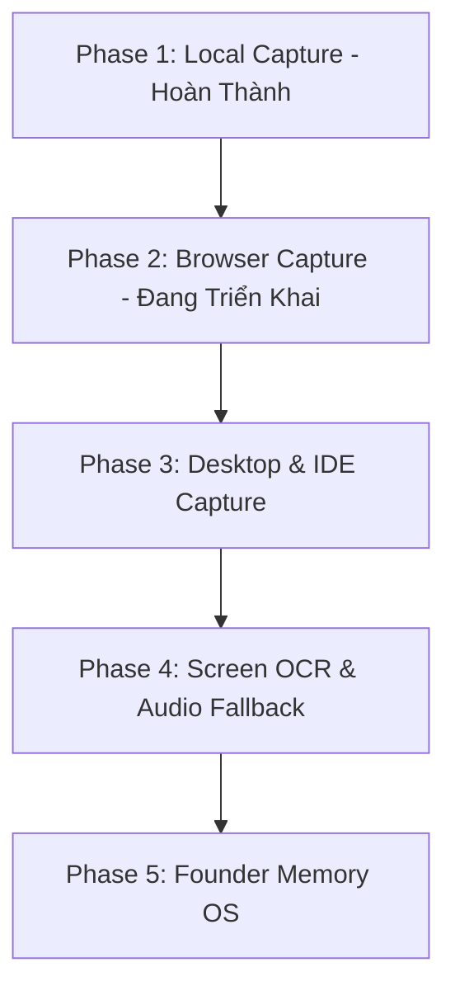

# CAPTURE_ROADMAP (Capture Layer Curation & Growth Plan)

Tài liệu thiết kế lộ trình phát triển nâng cấp lớp thu thập bối cảnh (Capture Layer) của **CentralContext**, hướng đến việc loại bỏ hoàn toàn các điểm mù bối cảnh và xây dựng một hệ thống ghi nhận tri thức toàn diện.

---

## 🔍 1. Reality Check (Đánh giá thất thoát bối cảnh thực tế)

Nếu Founder (tuoaoa) sử dụng đồng thời ChatGPT web, Gemini web, Antigravity app, VSCode chat, gõ Terminal trực tiếp và trao đổi qua Slack/Gmail trong 1 ngày làm việc:

```text
Thất thoát bối cảnh thực tế: 62%
```

### Phân tích nguyên nhân thất thoát
* **Mất bối cảnh trao đổi AI (Mất 35%)**: Khi gặp một bug phức tạp của Next.js hoặc Supabase, Founder thường chat qua lại hàng chục tin nhắn với ChatGPT/Gemini web để tìm cách giải quyết. CentralContext hiện tại **mất sạch 100%** cuộc đối thoại này nếu Founder không copy text vào clipboard. AI Agent sau này chỉ thấy file code bị sửa đổi mà không hiểu tại sao.
* **Mất bối cảnh gõ Terminal trực tiếp (Mất 15%)**: Mọi lệnh biên dịch lỗi, log crash của Express hay NPM install bị thất bại do xung đột dependency gõ trực tiếp ở terminal đều bị trôi mất.
* **Mất bối cảnh giao tiếp nghiệp vụ (Mất 12%)**: Lịch sử trao đổi yêu cầu sửa tính năng của người dùng/khách hàng qua Zalo/Slack hoàn toàn trống rỗng.

* **Nhận định thực tế**: Chỉ có **38%** bối cảnh viết code cục bộ và artifacts được lưu trữ tốt. 62% bối cảnh tư duy, thử và sai (trial and error) trên trình duyệt/terminal đã biến mất. CentralContext bắt buộc phải nâng cấp lên Phase 2 ngay lập tức!

---

## 🗺️ 2. Lộ trình phát triển Capture Layer (5-Phase Roadmap)

Triết lý phát triển của chúng ta là: **Capture Quality > Quantity** (Ưu tiên thu thập bối cảnh chất lượng cao có cấu trúc rõ ràng để tránh loãng token, thay vì chụp màn hình bừa bãi sinh rác).



---

### 🟢 Phase 1: Local File & Clipboard Capture (Đã Hoàn Thành)
* **Tính năng**: 
  - Watcher theo dõi thư mục dự án, tự động chắt lọc file `task.md`, `walkthrough.md`, `decisions.md` có debounce 3 giây và SHA-256 checking.
  - Clipboard spier bắt trọn vẹn các prompt AI chỉ thị nhạy bén.
  - Terminal Logger thông qua CLI wrapper.
* **Độ bao phủ thực tế**: **38%**.

### 🟡 Phase 2: Browser Chat Auto-Sync (Đang Triển Khai)
* **Tính năng**: 
  - Triển khai **Chrome Extension Manifest V3** tự động lắng nghe DOM bằng `MutationObserver` trên ChatGPT, Gemini, Claude web.
  - Tự động bóc tách tin nhắn User/Assistant, gán Conversation ID và gởi payload JSON kèm Hash chống trùng về SQLite/JSONL thô local.
* **Mục tiêu độ bao phủ**: **75%** (Bịt hoàn toàn lỗ hổng hội thoại AI).

### 🔵 Phase 3: Desktop & IDE Chat Capture (Kế Hoạch)
* **Tính năng**:
  - Tích hợp extension hoặc script lắng nghe lịch sử chat trong Cursor (Cursor Chathistory db) và VSCode Copilot.
  - Tích hợp **Zsh Terminal hook (`preexec` & `precmd`)** để tự động bắt 100% dòng lệnh gõ trực tiếp và mã lỗi thực thi ở shell mà không cần wrapper.
* **Mục tiêu độ bao phủ**: **85%**.

### 🟣 Phase 4: Screen OCR & Audio Fallback (Kế Hoạch)
* **Tính năng**:
  - Phát triển background daemon định kỳ chụp màn hình (1 phút/lần) dạng grayscale nén, chỉ chạy OCR cục bộ trích xuất text khi phát hiện có thay đổi lớn ở các ứng dụng không có API (Slack, Gmail, Discord).
  - Tự động mã hóa AES-256 cục bộ và tự hủy ảnh sau khi trích xuất để bảo đảm an toàn riêng tư tuyệt đối.
* **Mục tiêu độ bao phủ**: **92%**.

### 🔴 Phase 5: Founder Memory OS (Tầm Nhìn Dài Hạn)
* **Tính năng**:
  - Tích hợp dữ liệu từ Android **AI Memory OS** (VAD + Whisper.cpp ghi âm offline hội thoại thực tế ngoài đời và thông báo chat notification di động).
  - CentralContext hoạt động như "Shared Brain" tối thượng, kết hợp bối cảnh lập trình local trên Mac và bối cảnh hoạt động thực tế trên di động thành một luồng dữ liệu tri thức thống nhất qua cổng MCP Server SSE.
* **Mục tiêu độ bao phủ**: **98%**.
