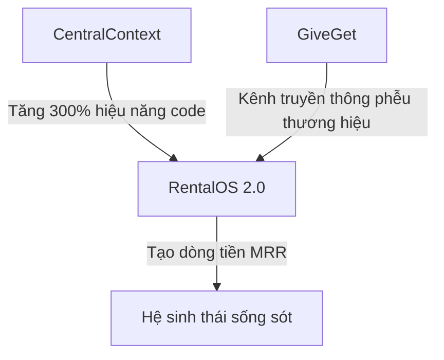

# CEO_DECISION_MEMO (Strategic C-Level Decision)

* **Người ban hành**: Acting CEO + CTO
* **Ngày hiệu lực**: 2026-05-30
* **Tình huống giả định**: Founder vắng mặt hoàn toàn trong 6 tháng. Không có liên lạc. Không có đội ngũ lớn. Ngân sách tiệm cận 0 USD. Tài nguyên duy nhất là 1 laptop MacBook và thời gian hữu hạn.
* **Mục tiêu**: Tái cấu trúc dứt khoát hệ sinh thái, lựa chọn giữ lại **tối đa 3 dự án** để tập trung 100% nguồn lực sống còn.

---

## 📋 Danh sách 3 dự án được giữ lại

Để bảo đảm hệ sinh thái sống sót và tạo ra dòng tiền tự nuôi dưỡng trong 6 tháng tới, Ban điều hành quyết định giữ lại đúng 3 dự án sau:

---

## 🚗 Dự án 1: qlythuexe (RentalOS 2.0)

* **Revenue Potential (Tiềm năng doanh thu)**: **90/100**  
  - Mô hình B2B SaaS thu phí định kỳ tháng (MRR) từ các chủ cửa hàng cho thuê xe máy, ô tô tự lái tại Việt Nam. Phí thuê bao dự kiến 300.000đ - 1.000.000đ/tháng/cửa hàng. Rất dễ mở rộng (scale) vì tệp khách hàng cực kỳ rộng lớn và phân mảnh.
* **Time To Revenue (Thời gian ra doanh thu)**: **Dưới 30 ngày**  
  - Toàn bộ DB Schema v2.6 và đặc tả kỹ thuật 12 Module đã được đóng băng hoàn chỉnh. Hạ tầng backend dựa trên Supabase Cloud giúp giảm thiểu thời gian code xuống mức tối đa. Bản MVP (Module A + POS quét CCCD + Zalo Deep Link nhắc nợ miễn phí) có thể hoàn thành và thu tiền thử nghiệm từ 2-3 cửa hàng của người quen ngay trong tháng đầu tiên.
* **Moat (Rào cản phòng thủ)**: **80/100**  
  - Cơ chế hoàn cọc 2 bước chống phạt nguội giải quyết trực tiếp nỗi đau lớn nhất của chủ xe.
  - Giải pháp nhắc nợ tự động VietQR qua Zalo Deep Link hoàn toàn miễn phí (Zero-Cost) giúp đè bẹp các đối thủ dùng tin nhắn SMS thương hiệu (Brandname SMS) đắt đỏ.
* **Risk (Rủi ro)**: **30/100**  
  - Chủ yếu là rủi ro đối soát tài chính ngân hàng và bảo mật thông tin CCCD quét từ eKYC. Cả hai đều có thể xử lý bằng Supabase RLS và API mã hóa.
* **Final Decision (Quyết định cuối cùng)**: **GIỮ LẠI & ƯU TIÊN SỐ 1**  
  - Đây là "Gà đẻ trứng vàng" bắt buộc phải làm để cứu sống hệ sinh thái về mặt tài chính trong bối cảnh ngân sách bằng 0.

---

## 🧠 Dự án 2: centalcontext (CentralContext)

* **Revenue Potential (Tiềm năng doanh thu)**: **85/100**  
  - Giai đoạn đầu: Đóng vai trò nội bộ tăng tốc lập trình. 
  - Giai đoạn 2: Đóng gói thành công cụ CLI trả phí hoặc SaaS quản lý bối cảnh dài hạn dành riêng cho cộng đồng kỹ sư phát triển AI Agent toàn cầu (Thị trường ngách cực lớn và đang bùng nổ).
* **Time To Revenue (Thời gian ra doanh thu)**: **90 ngày**  
  - Bản MVP local đã chạy mượt mà. Cần thêm 60 ngày để đóng gói API đồng bộ VPS, xây dựng cổng MCP Server SSE hoàn chỉnh và viết tài liệu thương mại hóa.
* **Moat (Rào cản phòng thủ)**: **85/100**  
  - Thuật toán chấm điểm dữ liệu thô (Curator Score 1-5) kết hợp với các quy tắc tương tác trực tiếp cho Agent (`MEMORY_RULES.md`) tạo thành một cơ chế quản trị tri thức Agent độc quyền.
* **Risk (Rủi ro)**: **20/100**  
  - Rủi ro kỹ thuật thấp do hạ tầng đơn giản (Express, SQLite WAL, chokidar). Chủ yếu là rủi ro cạnh tranh từ các công cụ quản lý context mã nguồn mở khác nếu không launch sớm.
* **Final Decision (Quyết định cuối cùng)**: **GIỮ LẠI & ƯU TIÊN SỐ 2**  
  - Đây là *đòn bẩy năng suất bắt buộc phải có*. Nếu không có CentralContext dọn đường bối cảnh, 1 Founder duy nhất với 1 laptop MacBook không thể nào hoàn thành nổi RentalOS 2.0 và GiveGet trong vòng 6 tháng.

---

## 🗺️ Dự án 3: GiveGet

* **Revenue Potential (Tiềm năng doanh thu)**: **50/100**  
  - Tiềm năng doanh thu trực tiếp thấp vì đối tượng nhận đồ (Getter) có hoàn cảnh khó khăn. Chỉ có thể thu phí hoa hồng rất nhỏ từ các tổ chức phi chính phủ (NGO) hoặc doanh nghiệp tài trợ chiến dịch CSR.
* **Time To Revenue (Thời gian ra doanh thu)**: **60 ngày**  
  - Lõi kỹ thuật Phase 0-3 đã xong, P0/P1 fixes đã xử lý xong trên staging. Chỉ cần deploy VPS để launch.
* **Moat (Rào cản phòng thủ)**: **80/100**  
  - Hệ thống điểm uy tín hảo tâm (Trust/Eco Points) ngăn chặn việc lạm dụng đồ từ thiện, kết hợp PostGIS định vị bản đồ thời gian thực tạo ra rào cản mạng lưới (network effect) cực mạnh khi có nhiều người tham gia.
* **Risk (Rủi ro)**: **40/100**  
  - Rủi ro pháp lý và danh tiếng nếu để xảy ra tình trạng lừa đảo trục lợi thiện nguyện trên app.
* **Final Decision (Quyết định cuối cùng)**: **GIỮ LẠI & ƯU TIÊN SỐ 3**  
  - Giữ lại không phải vì tiền, mà vì **phễu thương hiệu cá nhân (Brand Value)**. GiveGet sẽ là đầu tàu truyền thông xã hội xuất sắc, giúp Founder gây dựng uy tín lớn trong cộng đồng công nghệ Việt Nam, từ đó tạo lòng tin tuyệt đối để bán gói SaaS RentalOS 2.0 cho các chủ doanh nghiệp cho thuê xe.

---

## ⚖️ Trade-off & Opportunity Cost (Đánh đổi chiến lược)

Bằng việc dứt khoát giữ lại 3 dự án này và dũng cảm loại bỏ các dự án khác, chúng ta đã:
1. **Giải phóng 100% thời gian nghiên cứu R&D phần cứng**: Không còn chìm đắm vào việc đo đạc điện áp Tuya IoT hay sửa lỗi driver Bluetooth/Audio của Android.
2. **May đo nguồn lực hoàn hảo**: Dồn toàn bộ chất xám của duy nhất 1 lập trình viên vào việc hoàn thành những dòng code Next.js/Supabase thực tế để tạo ra doanh thu ngay lập tức, bảo đảm tính sinh tồn của devflow.
