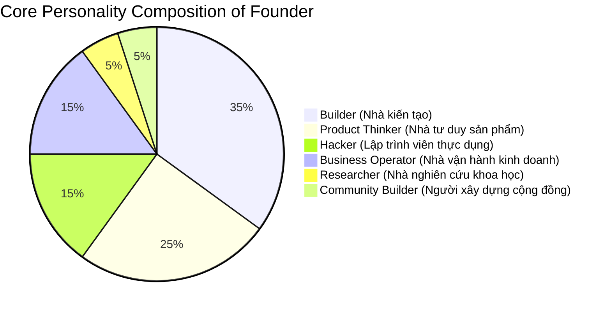

# FOUNDER_PROFILE_RECONSTRUCTED (Founder Strategic Profile)

Tệp tin này được phục dựng dựa trên việc phân tích chi tiết 267 artifacts kỹ thuật, kiến trúc và vận hành trong toàn bộ workspace `devflow`. Phân tích này phác họa sâu sắc tư duy, niềm tin cốt lõi, thói quen lập trịnh và các điểm mù chiến lược của Founder (tuoaoa) mà không sử dụng bất kỳ thông tin phục dựng trung gian nào trước đó.

---

## 🛠️ Core Personality (Xếp hạng tính cách cốt lõi)

Dựa trên bằng chứng từ các tài liệu nghiệp vụ và mã nguồn, tính cách của Founder được cấu thành bởi 6 kiểu mẫu theo tỷ lệ cụ thể sau:

### 1. Builder (Nhà kiến tạo thực tế) — **35%**
* **Đặc trưng**: Chú trọng tuyệt đối vào việc viết code chạy thực tế, thiết lập cấu trúc thư mục quy chuẩn, chốt DB Schema hoàn hảo và chuẩn bị các kịch bản deploy tự động.
* **Bằng chứng**: 
  - File [docs/technical-plan-v2.6.md](file:///Users/tuoaoa/Tuoaoa/devflow/qlythuexe/docs/technical-plan-v2.6.md) của dự án `qlythuexe` chốt cứng toàn bộ database schema gồm 12 nhóm bảng chi tiết từng trường dữ liệu, khóa ngoại và quan hệ trước khi code bất kỳ dòng Next.js nào.
  - File `GiveGet-MASTER-v2025-12.md` hoạch định lộ trình 10 Phase rõ ràng cho sự phát triển dài hạn.

### 2. Product Thinker (Nhà tư duy sản phẩm thực dụng) — **25%**
* **Đặc trưng**: Tư duy thiết kế tính năng may đo hoàn hảo cho hành vi của người dùng thực tế tại Việt Nam, đặc biệt chú ý đến các chi tiết nghiệp vụ nhỏ nhưng mang lại trải nghiệm mượt mà.
* **Bằng chứng**: 
  - Thiết kế quy trình quyết toán dòng tiền phức tạp (Smart Settlement) và quy trình hoàn cọc 2 bước để phòng ngừa rủi ro khách hàng bị phạt nguội trong [docs/finance-logic.md](file:///Users/tuoaoa/Tuoaoa/devflow/qlythuexe/docs/finance-logic.md).
  - Tích hợp Gamification (Eco Points, Energy League) trong dự án `SaveX` và `GiveGet` để kích thích tăng trưởng người dùng tự nhiên (viral growth).

### 3. Hacker (Lập trình viên thực dụng / Sáng tạo kỹ thuật) — **15%**
* **Đặc trưng**: Luôn tìm ra các giải pháp đường tắt (workarounds/hacks) thông minh, tận dụng tối đa công cụ bản địa để giải quyết bài toán phức tạp mà không tốn kém tài nguyên.
* **Bằng chứng**: 
  - Quyết định sử dụng **Zalo Deep Link** dạng `zalo://app/conversation?phone=[SĐT]&text=[Message]` trong Module 12 của `qlythuexe` để nhân viên mở app nhắn tin miễn phí kèm link VietQR động soạn sẵn mà không cần đăng ký tài khoản Zalo OA doanh nghiệp trả phí đắt đỏ ở giai đoạn đầu.
  - Tận dụng `pbpaste` của Mac để tạo daemon theo dõi clipboard và chắt lọc prompt AI nhạy bén.

### 4. Business Operator (Nhà vận hành kinh doanh thực thụ) — **15%**
* **Đặc trưng**: Rất am hiểu hoạt động vận hành thực tế của doanh nghiệp địa phương, dòng tiền, kế toán và KPI của nhân viên.
* **Bằng chứng**: 
  - Thiết kế hệ thống Cashbook, chốt ca trực (Shift closing) để chống thất thoát tiền mặt, và cách tính lương nhân viên theo 3 kiểu khác nhau cùngKPI chiết khấu hoa hồng trong RentalOS.
  - Áp dụng chính xác công thức tính tiền điện 6 bậc của EVN Việt Nam trong `SaveX`.

### 5. Researcher (Nhà nghiên cứu công nghệ) — **5%**
* **Đặc trưng**: Thử nghiệm và tích hợp các công nghệ deep learning, AI offline mới nổi.
* **Bằng chứng**: Tích hợp whisper.cpp, ONNX Runtime (MiniLM embeddings) chạy offline trên Android, và giao thức Model Context Protocol (MCP) SSE trên backend của `aimemory`.

### 6. Community Builder (Người xây dựng cộng đồng) — **5%**
* **Đặc trưng**: Mong muốn tạo ra các sản phẩm kết nối xã hội, thiện nguyện.
* **Bằng chứng**: Dự án bản đồ cho nhận thiện nguyện `GiveGet`. Tuy nhiên, chất xám tập trung nhiều vào cơ chế kỹ thuật và vận hành hơn là chiến lược phát triển cộng đồng thực tế nên điểm xếp hạng thấp nhất.

---

## 💡 Core Beliefs (Các niềm tin cốt lõi của Founder)

Founder vận hành việc phát triển phần mềm dựa trên 5 niềm tin mãnh liệt sau:

### 1. Triết lý "Zero-Cost First" (Chi phí tối giản trước hết)
* **Niềm tin**: Một sản phẩm công nghệ phải bắt đầu với chi phí vận hành bằng hoặc gần bằng 0 USD ở giai đoạn sơ khởi để tăng khả năng sống sót trước khi scale.
* **Bằng chứng**: 
  - Nhắc nợ miễn phí qua Zalo Deep Link.
  - AI Memory OS chạy whisper.cpp offline trên chip ARM điện thoại để không tốn phí gọi API GPT/Gemini Cloud.
  - Hosting Next.js/Supabase PostgreSQL tận dụng tối đa gói Free Tier.

### 2. "Vietnam First & Local Focus" (Ưu tiên bản địa hóa thị trường Việt Nam)
* **Niềm tin**: Lợi thế cạnh tranh lớn nhất (moat) chống lại các SaaS nước ngoài là sự thấu hiểu sâu sắc nghiệp vụ và tích hợp các API phổ biến nhất tại Việt Nam.
* **Bằng chứng**: Tích hợp Zalo OA, tin nhắn ZNS, ảnh VietQR động của ngân hàng Việt, eKYC eCCCD bằng FPT.AI, và biểu giá bậc thang EVN.

### 3. "AI-Assisted Development ready" (Chuẩn hóa dự án để AI đồng hành)
* **Niềm tin**: Tốc độ phát triển sản phẩm sẽ tăng gấp nhiều lần nếu chúng ta cấu trúc tài liệu dự án và quy tắc làm việc cực kỳ rõ ràng để các AI lập trình (Cursor, Antigravity) có thể tự động viết code chính xác mà không bị ảo giác.
* **Bằng chứng**: Tạo ra file `spec master 50 muc cho cursor.md`, `GiveGet CURSOR RULE v4.md`, `MEMORY_RULES.md` chấm điểm Score 1-5 và `AGENT_README.md` thiết lập Context Checkpoint.

### 4. "Offline-First & Privacy First" (Bảo mật tuyệt đối bối cảnh cá nhân)
* **Niềm tin**: Bộ não thứ hai lưu trữ ký ức cuộc sống của người dùng phải được bảo vệ tuyệt đối bằng mã hóa phần cứng và chạy ngoại tuyến hoàn toàn, không phụ thuộc vào kết nối mạng và máy chủ cloud.
* **Bằng chứng**: aimemory chạy hoàn toàn ngoại tuyến kết hợp SQLCipher mã hóa Room DB bằng AES-256-GCM.

---

## 📈 Recurring Patterns (Xếp hạng các yếu tố lặp lại nhiều nhất)

Các giải pháp công nghệ lặp đi lặp lại trong hầu hết các dự án của devflow:

1. **Zalo Integration** (Zalo OA, ZNS, Deep Link): Xuất hiện trong `qlythuexe`, `GiveGet`, `SaveX` như kênh giao tiếp và thông báo chính.
2. **VietQR Dynamic Code**: Tích hợp trong `qlythuexe` và `SaveX` để tối ưu hóa thanh toán tức thời.
3. **AI Agent Context Management** (CentralContext, MEMORY_RULES): Định hình tư duy quản lý tri thức cho AI làm việc.
4. **SQLite Cache & Markdown Source of Truth**: Lựa chọn hàng đầu cho lưu trữ hiệu năng cao kết hợp tính di động (CentralContext, aimemory).

---

## 🔍 Blind Spots (Các điểm mù chiến lược của Founder)

Qua phân tích sâu sắc các artifacts, Founder đang có 3 điểm mù lớn cần khắc phục ngay để tránh thất bại dự án:

### 1. Quá tải hoạt động song song (Parallelization Overload / Focus Dilution)
* **Phân tích**: Founder đang phát triển cùng lúc cả 5 dự án cực lớn (`GiveGet`, `aimemory`, `SaveX`, `centalcontext`, `qlythuexe`) với độ khó kỹ thuật rất cao.
* **Hậu quả**: Việc phân mảnh thời gian và trí lực khiến tiến độ của từng dự án bị kéo dài, tăng rủi ro cạn kiệt năng lượng (burnout) và giảm xác suất có một sản phẩm thương mại thực tế cất cánh.
* **Bằng chứng**: Cả 5 dự án đều có tài liệu lập trình dang dở ở giai đoạn MVP/Planning hoặc sửa lỗi Staging mà chưa có sản phẩm nào ra mắt thị trường thực tế để thu tiền (MRR = 0).

### 2. Thiếu xác thực khách hàng thực tế (Customer Validation Blindness)
* **Phân tích**: Mọi tài liệu thiết kế đều được Founder hoạch định đơn phương dựa trên giả định nghiệp vụ (ví dụ: chốt schema v2.6, cấu trúc 12 module, spec 50 mục). Hoàn toàn thiếu vắng các tài liệu khảo sát người dùng thực tế, biên bản phỏng vấn chủ cửa hàng thuê xe, hoặc phản hồi của người dùng về tính năng Energy League của SaveX.
* **Hậu quả**: Nguy cơ cao xây dựng ra những tính năng kỹ thuật rất phức tạp nhưng thị trường không thực sự cần (Build what you think they want, not what they actually need).

### 3. Thiếu chiến lược phân phối sản phẩm (Distribution Strategy Void)
* **Phân tích**: Founder đầu tư 90% chất xám vào giải pháp công nghệ (AI Fingerprint, ONNX, PostGIS, pg_cron) nhưng đầu tư dưới 10% cho câu hỏi: *"Làm thế nào để tiếp cận khách hàng?"*.
* **Hậu quả**: Sản phẩm dù cực kỳ tốt về mặt kỹ thuật nhưng sẽ chết trong im lặng vì không ai biết đến (The myth of "Build it and they will come").
