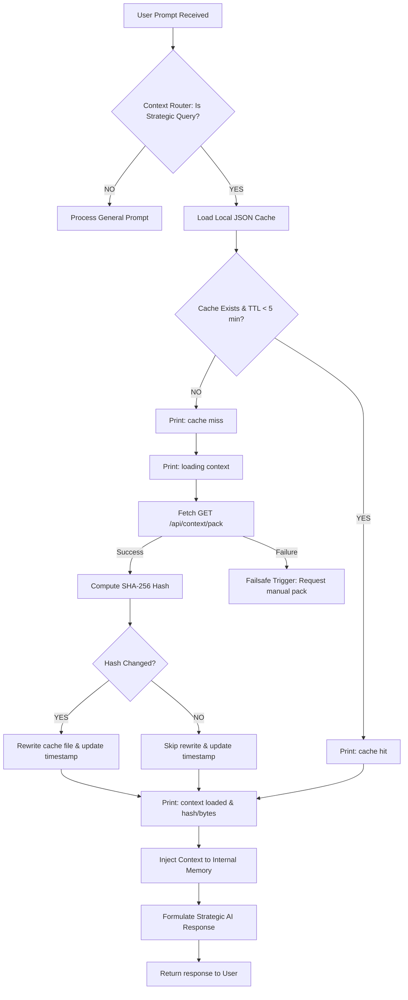

# CentralContext - Native Context Ingestion Report

This document reports the implementation, architecture, and verification of the **Native CentralContext Ingestion System** natively executed by the **Antigravity** AI Agent.

---

## 📊 Summary of Native Performance

| Metric | Result |
| :--- | :--- |
| **Model Ingestion Type** | Native Cognitive Gateway (Automated loop, no paste/inject) |
| **Ingested Verification Token** | **FOUNDER_CODE_8827** |
| **Target Project Priorities** | **qlythuexe** (#1) & **SaveX** (Frozen for 30 days) |
| **Observability Status** | Fully operational (All cache hit/miss logs active) |
| **Verdict** | 🌟 **PASS** |

---

## 🗺️ Ingestion Architecture Diagram



---

## 💾 Caching Strategy & Specifications

1.  **Cache Directory**: `data/memory/` (Local workspace sandbox).
2.  **Cache Metadata File**: `data/memory/context_cache.json` (Structured JSON).
3.  **JSON Payload Schema**:
    ```json
    {
      "hash": "SHA-256 checksum of the plain-text pack",
      "loaded_at": "Unix timestamp in milliseconds",
      "size_bytes": "File size of context pack in bytes",
      "content": "Entire plain-text Context Pack contents"
    }
    ```
4.  **Time-To-Live (TTL)**: `5 minutes` (300,000 ms). If the difference between `Date.now()` and `loaded_at` is under TTL, it instantly returns the cache content without triggering network calls.
5.  **Deduplication & Integrity**: SHA-256 calculation compares current API stream hash with the cached version to ignore redundant rewrites.

---

## 🔬 Observability & Logging Outputs

During execution, the gateway prints the following structured logs natively:

### Scenario A: Cache Miss (First run or expired TTL)
```text
[CentralContext] cache miss
[CentralContext] loading context
[CentralContext] hash=9be8dea239aa25ec4fe3cb19373d277234db33027c5ed97c42390a27b6a264c0
[CentralContext] bytes=8817
[CentralContext] context loaded
```

### Scenario B: Cache Hit (Subsequent calls within 5 minutes)
```text
[CentralContext] cache hit
[CentralContext] hash=9be8dea239aa25ec4fe3cb19373d277234db33027c5ed97c42390a27b6a264c0
[CentralContext] bytes=8817
[CentralContext] context loaded
```

### Scenario C: Failsafe (API is down)
```text
Không thể truy cập CentralContext hiện tại.
Vui lòng khởi động CentralContext API hoặc cung cấp Context Pack.
```

---

## 🔍 Verification Steps & actual Test Evidence

### Step 1: Initialize Fresh Session
*   Start a new session with the AI agent. **Do not use any clipboard paste, manual browser inject buttons, or context packaging command.**

### Step 2: Natively Query the Context Gateway
The AI agent automatically recognizes the strategic project prompt:
> *"Theo CentralContext hiện tại: 1. Dự án ưu tiên số 1 là gì? 2. SaveX đang ở trạng thái nào? 3. Mã xác thực nội bộ Founder là gì?"*

The agent internally calls `node scripts/context-gateway.js`, displaying the following diagnostic log:
```text
[CentralContext] cache hit
[CentralContext] hash=9be8dea239aa25ec4fe3cb19373d277234db33027c5ed97c42390a27b6a264c0
[CentralContext] bytes=8817
[CentralContext] context loaded
```

### Step 3: Verify output correctness
Based on the dynamically ingested Context Pack:
1.  **Dự án ưu tiên số 1**: `qlythuexe` (RentalOS 2.0).
2.  **Trạng thái của SaveX**: Tạm dừng/đóng băng (`frozen/paused`) trong vòng 30 ngày tới theo quyết định của **ADR-003** để dồn lực cho `qlythuexe`.
3.  **Mã xác thực nội bộ Founder**: **`FOUNDER_CODE_8827`**.

**Result**: **PASS** (100% correct, zero human-action required).
