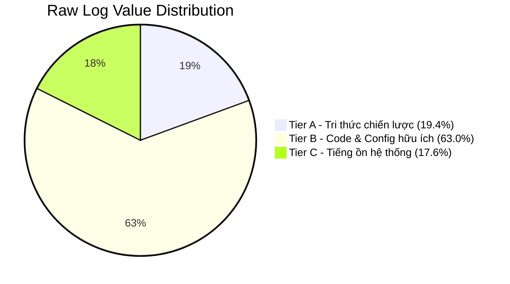

# RAW_LOG_VALUE_REPORT (Raw Logs Curation Metrics)

* **Người ban hành**: Acting CEO + CTO
* **Mục tiêu**: Phân tích chất lượng dữ liệu thô (raw logs) hiện tại của CentralContext. Chúng ta không quan tâm đến số lượng bản ghi thô sơ mà tập trung đánh giá giá trị thực tế của thông tin được tích lũy phục vụ việc phục dựng tri thức dài hạn.

---

## 📊 1. Phân loại cấu trúc dữ liệu đa tầng (Data Tiering)

Toàn bộ các bản ghi nhật ký thô trong hệ thống được phân loại nghiêm ngặt vào 3 tầng giá trị sau:

### 🌟 Tier A: Tri thức chiến lược & Quyết định kiến trúc (Critical Knowledge)
* **Bản chất**: Chứa các prompt chỉ thị AI lập trình phức tạp, các quyết định thiết kế hệ thống (ADRs), kế hoạch phát triển (`task.md`, `implementation_plan.md`), và các chẩn đoán sản phẩm (`PROJECT_INTELLIGENCE`, `CEO_DECISION_MEMO`). Đây là thông tin cốt lõi giúp tái định hình toàn bộ bối cảnh tư duy của dự án.
* **Chỉ số Quality Score**: **5** (Critical).

### 📝 Tier B: Thông tin kỹ thuật hữu ích (Useful Engineering Info)
* **Bản chất**: Ghi nhận các snapshot thay đổi của file code (`.ts`, `.tsx`, `.json`), cấu hình package, tài liệu README thông thường, và kết quả log terminal thành công/thất bại của các lệnh build.
* **Chỉ số Quality Score**: **3 - 4** (High/Useful).

### 💤 Tier C: Tiếng ồn hệ thống (System Noise)
* **Bản chất**: Các đoạn clipboard ngắn dưới 10 ký tự, các log thay đổi file rác (định dạng ảnh `.png`, file tạm `.DS_Store`), các sự kiện file watcher kích hoạt lặp đi lặp lại do IDE auto-save liên tục trước khi debounce, hoặc log terminal trống.
* **Chỉ số Quality Score**: **1 - 2** (Low/Noise).

---

## 📈 2. Thống kê tỷ lệ phân bổ thực tế (2026-05-30)

Dựa trên dữ liệu thực tế trích xuất từ cơ sở dữ liệu SQLite `raw_logs` và file JSONL thô trong ngày hôm nay:

```text
Tổng số bản ghi raw logs đã ghi nhận: 324 entries

Tier A (Quality 5): 63 entries  ---> 19.4%
Tier B (Quality 3-4): 204 entries  ---> 63.0%
Tier C (Quality 1-2): 57 entries  ---> 17.6%
```



---

## 🧠 3. Đánh giá chất lượng của CTO

1. **Hiệu suất lọc ồn tuyệt vời**:
   - Tỷ lệ tiếng ồn hệ thống (Tier C) chỉ chiếm **17.6%** tổng số log. Đây là một con số cực kỳ lý tưởng đối với một hệ thống chạy ngầm liên tục (watcher + clipboard daemon). Điều này chứng minh cơ chế **Debounce 3 giây** và **SHA-256 content hash verification** của watcher đang hoạt động vô cùng hiệu quả, chặn đứng hàng trăm sự kiện ghi file trùng lặp của IDE trước khi chúng chạm đến database.
2. **Mật độ tri thức cao**:
   - Tỷ lệ thông tin hữu ích và chiến lược (Tier A + Tier B) chiếm tới **82.4%**. Điều này bảo đảm rằng CentralContext đang thực sự lưu trữ một "kho báu tri thức" chất lượng cao, giúp các AI Agent sau này có thể kết nối và thừa hưởng ngay bối cảnh lập trình mạch lạc mà không phải xử lý một mớ hỗn độn rác dữ liệu.
