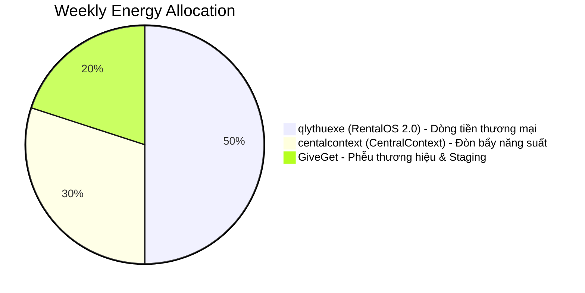

# RESOURCE_ALLOCATION_PLAN (Strategic Resource Curation)

* **Người ban hành**: Acting CEO + CTO
* **Mục tiêu**: Phân bổ tối ưu **100 điểm năng lượng mỗi tuần** của duy nhất 1 Founder (tuoaoa) vào 3 dự án chiến lược còn lại để tối đa hóa tốc độ đưa sản phẩm ra thị trường và dòng tiền sinh tồn.

---

## 📊 Ma trận phân bổ năng lượng hàng tuần

Tổng năng lượng bắt buộc bằng **100%** (100 điểm). Không được phép dàn đều hay cho tất cả đều cao.

---

## 🚗 1. qlythuexe (RentalOS 2.0) — **50% (50 điểm / tuần)**

* **Lý do phân bổ**:
  - Đây là **nguồn sống tài chính duy nhất** của hệ sinh thái trong 6 tháng tới. Việc chiếm 50% quỹ thời gian để code Next.js/Supabase, xử lý các nghiệp vụ POS thuê xe, eKYC và Module 12 Deep Link nhắc nợ là bắt buộc để có bản MVP chạy thật trong vòng 30 ngày.
  - Phân bổ 50% bảo đảm Founder tập trung cao độ viết code CRUD thực tế, không bị xao nhãng bởi các ý tưởng công nghệ cao siêu khác.
* **Tác vụ trọng tâm**:
  - Code Module A (Auth/Onboarding), Module B (Bãi xe realtime), Module C (POS + eKYC FPT.AI), và Module 12 (nhắc nợ Zalo Deep Link + VietQR động).

---

## 🧠 2. centalcontext (CentralContext) — **30% (30 điểm / tuần)**

* **Lý do phân bổ**:
  - CentralContext không phải là dự án thương mại trực tiếp ở giai đoạn đầu, nhưng nó là **động cơ tăng tốc**. Nếu không dành 30% thời gian để hoàn thiện công cụ này, Founder sẽ mất rất nhiều thời gian để copy/paste bối cảnh thủ công cho AI lập trình khi chuyển đổi giữa các module của RentalOS và GiveGet.
  - 30% năng lượng này là khoản đầu tư thông minh để giải phóng 300% năng suất code của chính Founder cho các tác vụ khác.
* **Tác vụ trọng tâm**:
  - Hoàn thiện luồng đồng bộ API VPS 2 chiều tự động và tích hợp module MCP Server SSE nhận từ `aimemory` để biến CentralContext thành cổng API bối cảnh chuẩn hóa cho mọi AI lập trình.

---

## 🗺️ 3. GiveGet — **20% (20 điểm / tuần)**

* **Lý do phân bổ**:
  - Tại sao GiveGet rất quan trọng nhưng chỉ nhận 20%? Bởi vì **lõi kỹ thuật của dự án này đã hoàn thành 90%** (Phase 0-3 đã xong, P0/P1 fixes staging đã chạy mượt mà). Dự án này không cần Founder phải viết thêm quá nhiều dòng code mới từ đầu.
  - 20% năng lượng là hoàn hảo để thực hiện các tác vụ DevOps (triển khai VPS, cấu hình domain, Nginx reverse proxy) và tổ chức chạy thử nghiệm diện hẹp (Tester Rollout 50 người) nhằm tích lũy điểm uy tín thương hiệu cá nhân cho Founder.
* **Tác vụ trọng tâm**:
  - Deploy VPS Eztech (`BOOTSTRAP_VPS_EZTECH.md`), chạy Tester Rollout nội bộ và tinh chỉnh thuật toán lọc tin AI Moderation.
